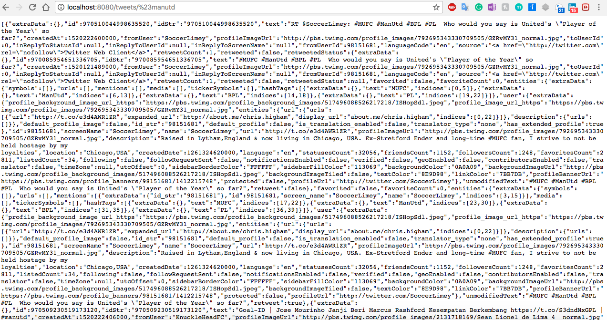
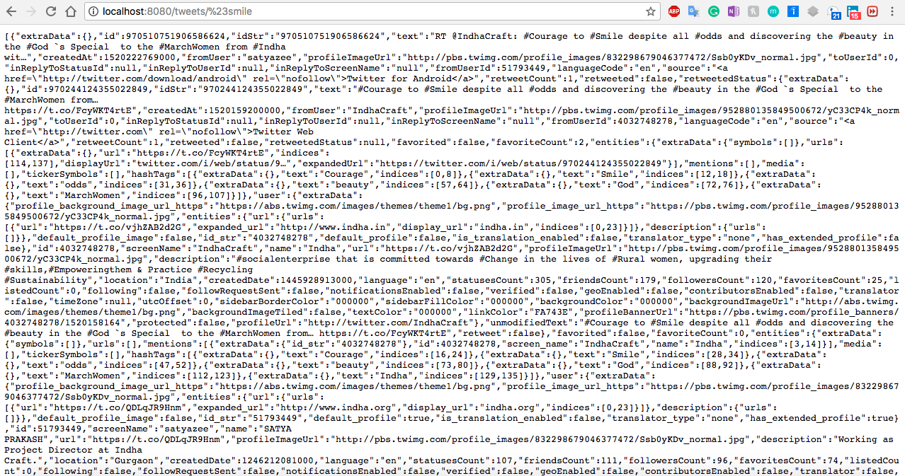

# Spring Social Twitter Example - access-twitter-hashtag-data

## Java, Spring, Twitter API

## Deployment

* Clone this github repo
* Imprt project to eclipse as existing maven project
* Change app-id and app-secret in application.properties
* Go to project directory and run below command
```
mvn spring-boot:run
```

## Deployment
 Steps:
* Go to Spring Stater 
```
https://start.spring.io/
```
* Select spring version Spring Boot
* Fill the Project Metadata
* Click on Switch to the full version link below generate project button.
* Select web and Twitter dependancy
* Generate project
* Import downloaded zip as a maven project in eclipse
* Create developer app on twitter and put your details in applications.properties
```
spring.social.twitter.app-id=
spring.social.twitter.app-secret=
```
Hit below url
```
http://localhost:8080/tweets/%23manutd

Note: %23 is #(hash)
```
you will get latest 25 tweets for that hashtag

* You can replace manutd with any other hashtag of your choice in browser

## Output

Below are snapshot. Do whatever you want to achieve with this data.

```
For manutd hashtag
```


```
For smile hashtag
```


## Acknowledgments

* Philip Starritt
* Link: https://youtu.be/c1tzxlcpkUA
 
